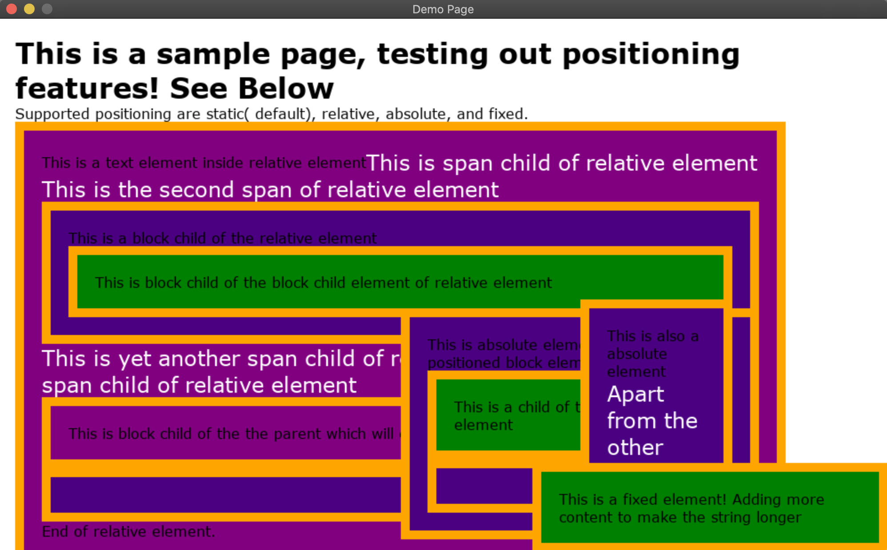

# A Browser Rendering Engine in Python

## INTRODUCTION
This project implements a simplified browser rendering engine in python.
Uses pygame as the UI backend for painting and layout (of text).



The project only supports a limited subset of HTML and CSS. 

### HTML

- All elements must be either self-closing or have start and end tags
- Supports comments and doctype declaration.
- Supports text
- Supports only `id` and `class` attributes, and ignores remaining.
    - element can have multiple classes (space separated list)
- Does not support different tag contexts (like _script_)
- Tag names can be anything. 
    - However by default elements with unknown tags have `display: none`.
    - `display` property must be set in user style sheets for other elements.
- Handles some amount of missing/erroneous end tags
 
### CSS

- Supports multiple CSS files.
- Browser (default) styles are defined in `agent.css`
- Only simple selectors are supported 
    - universal, tag, id and class selectors (eg, `*`, `div`, `.class`, `#id`). 
- Each CSS rule must have only one selector
- Supports Cascading, Specificity and Inheritance.
    - Specificity is limited by selectors supported
- Supported CSS properties can be found at `css_properties.py`.
    - box-model properties: 
    `margin-top`, `margin-bottom`, `margin-left`, `margin-right`,
    `padding-top`, `padding-bottom`, `padding-left`, `padding-right`,
    `border-top-width`, `border-bottom-width`, `border-bottom-left`, `border-bottom-right`,
    `width`, `height`, `top`, `bottom`, `left`, `right`.
    - colors: `color`, `background-color`, `border-color`
    - fonts: `font-size`, `font-weight`, `font-style`
    - layout: `display`, `position`
- Supports `display` types of `none`, `block` and `inline`
- Supports `position` types of `static`, `relative`, `absolute` and `fixed`.
- Box model properties can be specified as `auto`, or in pixels `px` or in percentage `%`
- Colors (`color`, `background-color`, `border-color`) must be in RGB (eg, `#ffffff`). 
    - `background-color` can also be `transparent`
- `font-size` must be in pixels `px`. `font-weight` can be `normal` or `bold`. 
  `font-style` can be `normal` or `italic`
- Some properties can be inherited (value is `inherit`). 
    - `color`, `background-color`, `border-color`, `font-size`, `font-weight`, `font-style`

## SETUP

Needs python 3.8 or above.

Install dependencies using:

    pip install -r requirements.txt

Run the program using
    
    python main.py --html index.html --css index.css

For more options

    python main.py --help

Note: Program supports multiple CSS files.

## Implementation Details

A Modern Browser has several major components each performing different functions. 
Rendering Engine is one of them which parses HTML and CSS and displays it onto the screen.
Different browsers use different rendering engines, like firefox uses Gecko, etc. 

Rendering typically involves the following steps:
1. Constructing a DOM tree from HTML, enriching the styles from CSS
2. Constructing a render tree, consisting of nodes that will we displayed on the screen.
3. Computing the layout of the render tree, ie, computing the sizes and positions of the nodes on the screen.
4. Painting the render tree onto the screen.

These steps are performed by different sub-components of the rendering engine.
Following are the sub-components of this simplified rendering engine:
1. HTML Parser
2. CSS Parser
3. Attachment
4. Renderer
5. Layout
6. Paint

### HTML Parser
Parses HTML contents and generates a DOM tree.
It consists of a tokenizer and a parser

Tokenizer converts the HTML content into a stream of token of different kinds.
Tokens are identified using regular expressions. 
Token kinds are start tags, end tags, self-closing tags, text, comments, doctype and spaces.
Comments, doctype and spaces tokens are ignored. Rest are used to construct the DOM tree. 
Start tag and self-closing tag tokens also have attributes (map of key-value pairs) extracted from HTML.

Additionally, all tag names, attribute key-value pairs are converted into lower case. 
Excessive spaces from text are also removed and text is trimmed.

```python
class Token:
    kind: str   # type of token
    value: str
    attributes: dict[str, str]
```


### Additional Resources
- [How Browsers Work: Behind the scenes of modern web browsers](https://www.html5rocks.com/en/tutorials/internals/howbrowserswork/)
- [Kruno: How browsers work | JSUnconf 2017](https://www.youtube.com/watch?v=0IsQqJ7pwhw)
- [Ryan Seddon: So how does the browser actually render a website | JSConf EU 2015](https://www.youtube.com/watch?v=SmE4OwHztCc)
- [Let's build a browser engine! - Matt Brubeck](https://limpet.net/mbrubeck/2014/08/08/toy-layout-engine-1.html)
- [Parsing HTML documents - HTML Living Standard](https://html.spec.whatwg.org/multipage/parsing.html)
- [The HTML Syntax - HTML Living Standard](https://html.spec.whatwg.org/multipage/syntax.html)
- [HTML 4.01 Specification](https://www.w3.org/TR/html401/)
- [W3 Introduction to CSS2](https://www.w3.org/TR/WD-CSS2/intro.html)
- [W3 HTML2 DOM IDL Definitions](https://www.w3.org/TR/2003/REC-DOM-Level-2-HTML-20030109/idl-definitions.html)
- [Mozilla CSS Cascade and Inheritance](https://developer.mozilla.org/en-US/docs/Learn/CSS/Building_blocks/Cascade_and_inheritance)
- [Inline elements and Padding - Russ Weakley](https://maxdesign.com.au/articles/inline/)
- [W3 CSS 2 Visual Formatting Model](https://www.w3.org/TR/CSS22/visuren.html)
- [Python re - writing a tokenizer ](https://docs.python.org/3/library/re.html#writing-a-tokenizer)
- [How browser rendering works — behind the scenes - Ohans Emmanuel](https://blog.logrocket.com/how-browser-rendering-works-behind-the-scenes-6782b0e8fb10/)
- [Inside look at modern web browser - Mariko Kosaka](https://developers.google.com/web/updates/2018/09/inside-browser-part1)
- [Regex Tester](https://extendsclass.com/regex-tester.html)
- [Chromium User Agent CSS](https://chromium.googlesource.com/chromium/src/third_party/+/master/blink/renderer/core/html/resources/html.css)
- [Firefox User Agent CSS](https://searchfox.org/mozilla-central/source/layout/style/res/html.css)
- [WebKit User Agent CSS](https://trac.webkit.org/browser/trunk/Source/WebCore/css/html.css)
- [W3 CSS2 Box Model](https://www.w3.org/TR/CSS22/box.html)